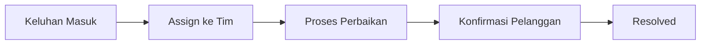

# Manajemen Keluhan (Complaints)

Fitur **Complaints** dirancang untuk menangani masukan negatif atau keluhan pelanggan secara sistematis untuk menjaga kepuasan pelanggan.

## Fitur Utama
*   **Registrasi Keluhan**: Catat detail keluhan, kategori (misal: Layanan, Produk, Teknis), dan tingkat urgensi.
*   **Assign ke Tim Terkait**: Teruskan keluhan ke departemen yang berwenang untuk penyelesaian.
*   **Tracking Status**: Pantau apakah keluhan sedang diinvestigasi, diproses, atau sudah diselesaikan (*Resolved*).
*   **SLA Tracking**: Memastikan keluhan ditangani dalam jangka waktu yang telah ditentukan oleh kebijakan perusahaan.

## Alur Kerja (Workflow)
1.  **Reporting**: Mencatat detail keluhan yang diterima dari pelanggan (via telepon, email, atau tatap muka).
2.  **Assignment**: Mengalokasikan keluhan kepada departemen yang relevan.
3.  **Action**: Tim yang ditugaskan melakukan investigasi dan tindakan perbaikan.
4.  **Resolution**: Memberikan feedback kepada pelanggan dan menandai keluhan sebagai *Resolved*.

