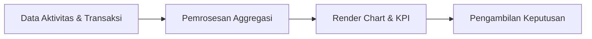

# Dashboard & Analitik

**Dashboard** adalah pusat kendali visual yang memberikan gambaran cepat tentang kesehatan bisnis dan performa tim sales.

## Fitur Utama
*   **Visualisasi Data (Charts)**: Grafik interaktif (Bar, Line, Pie) menggunakan library **Recharts** untuk melacak tren penjualan dan pertumbuhan lead.
*   **Key Performance Indicators (KPI)**: Ringkasan angka penting seperti total pendapatan, jumlah deal aktif, dan tingkat konversi.
*   **Filter Global**: Kemampuan untuk memfilter dashboard berdasarkan rentang waktu (Mingguan, Bulanan, Tahunan) atau departemen tertentu.
*   **Real-time Updates**: Data diperbarui secara otomatis mencerminkan aktivitas terbaru di sistem.

## Alur Kerja (Workflow)
1.  **Data Collection**: Sistem mengumpulkan data secara real-time dari setiap transaksi (Leads, Deals, Invoices).
2.  **Aggregation**: Menghitung total dan persentase berdasarkan parameter yang dipilih.
3.  **Visualization**: Merender data ke dalam chart yang mudah dibaca.
4.  **Analysis**: Pengguna menggunakan informasi visual untuk mengambil keputusan strategis.

