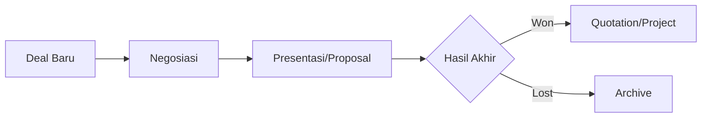

# Manajemen Deals

Fitur **Deals** digunakan untuk mengelola peluang bisnis yang sedang berjalan. Setelah Lead dikonversi, ia akan menjadi Deal yang memiliki nilai ekonomi dan estimasi waktu penutupan.

## Fitur Utama
*   **Pipeline Management**: Kelola proses penjualan melalui tahapan pipeline yang terstruktur.
*   **Nilai Deal**: Pencatatan estimasi nilai transaksi untuk membantu proyeksi pendapatan (revenue forecasting).
*   **Probability & Forecast**: Menentukan persentase kemungkinan menang (*winning probability*) pada setiap tahap.
*   **Timeline Closing**: Penetapan target tanggal penutupan deal (*expected closing date*).
*   **Win/Loss Analysis**: Menandai deal sebagai *Won* atau *Lost* dengan alasan tertentu untuk analisis performa tim.

## Alur Kerja (Workflow)
1.  **Inisiasi**: Deal dibuat dari konversi Lead atau input langsung untuk peluang baru.
2.  **Manajemen Pipeline**: Menggeser deal melalui tahapan pipeline seiring dengan kemajuan negosiasi.
3.  **Proyeksi**: Memperbarui nilai dan probabilitas untuk akurasi laporan *forecast*.
4.  **Closing**: Menentukan hasil akhir sebagai **Won** (berhasil) atau **Lost** (gagal). Jika Won, dapat dilanjutkan ke tahap **Quotation** atau **Project**.

## Kaitan dengan Fitur Lain
Deal merupakan pusat dari aktivitas penjualan yang nantinya dapat dilanjutkan dengan pembuatan **Quotation** atau **Project** jika deal berhasil dimenangkan.

