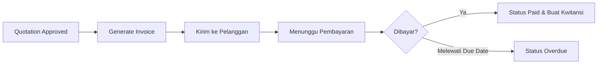

# Manajemen Invoices

Fitur **Invoices** adalah alat utama untuk penagihan pembayaran kepada klien setelah deal atau pekerjaan selesai dilakukan.

## Fitur Utama
*   **Generate dari Quotation/Deal**: Tarik data otomatis dari penawaran yang sudah disetujui untuk membuat invoice.
*   **Manajemen Termin**: Pengaturan termin pembayaran (Due Date) dan pengingat otomatis.
*   **Tracking Pembayaran**: Tandai invoice sebagai *Unpaid, Partially Paid,* atau *Paid*.
*   **Ekspor Dokumen**: Cetak invoice ke format PDF profesional atau ekspor data ke Excel untuk keperluan akuntansi.
*   **Riwayat Penagihan**: Catatan lengkap kapan invoice dikirim dan kapan pembayaran diterima.

## Alur Kerja (Workflow)
1.  **Generation**: Invoice dibuat dari data Quotation yang sudah disetujui atau dibuat secara manual.
2.  **Billing**: Dokumen dikirim ke pelanggan dengan informasi batas waktu pembayaran (Due Date).
3.  **Tracking**: Memantau status pembayaran melalui dashboard finansial.
4.  **Completion**: Setelah pembayaran diterima, invoice ditandai sebagai *Paid*, dan sistem dapat otomatis menghasilkan **Kwitansi**.

## Integrasi
Data invoice terhubung langsung dengan modul **Clients** untuk memperbarui saldo atau riwayat transaksi pelanggan.

