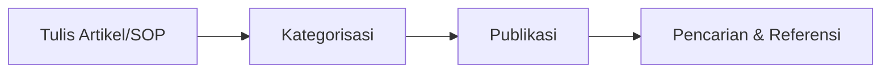

# Knowledge Base & SOP

Fitur **Knowledge Base** berfungsi sebagai perpustakaan digital perusahaan yang berisi informasi penting, panduan, dan prosedur standar.

## Fitur Utama
*   **Artikel & Dokumentasi**: Tulis dan simpan panduan penggunaan produk atau informasi teknis.
*   **SOP (Standard Operating Procedure)**: Tempat penyimpanan prosedur kerja internal agar seluruh tim memiliki standar yang sama.
*   **Kategorisasi Konten**: Kelompokkan artikel berdasarkan topik atau departemen untuk pencarian yang lebih mudah.
*   **Fitur Pencarian**: Temukan jawaban dengan cepat menggunakan bar pencarian yang responsif.

## Alur Kerja (Workflow)
1.  **Penyusunan**: Admin atau Manajer menulis artikel/panduan baru.
2.  **Organisasi**: Menentukan kategori dan tag yang relevan untuk artikel tersebut.
3.  **Publikasi**: Artikel diterbitkan dan tersedia untuk diakses oleh seluruh tim.
4.  **Akses**: Tim menggunakan fitur pencarian untuk menemukan informasi saat melayani pelanggan atau menjalankan SOP.

