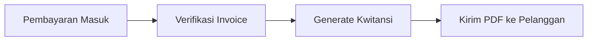

# Manajemen Kwitansi

Fitur **Kwitansi** berfungsi sebagai bukti sah penerimaan pembayaran dari pelanggan.

## Fitur Utama
*   **Bukti Bayar Otomatis**: Generate kwitansi langsung setelah invoice ditandai sebagai "Paid".
*   **Pencatatan Metode Bayar**: Dokumentasikan apakah pembayaran melalui transfer bank, tunai, atau metode lainnya.
*   **Nomor Referensi Unik**: Penomoran otomatis yang berurutan untuk memudahkan audit internal.
*   **Cetak PDF**: Format siap cetak yang rapi untuk dikirimkan kembali ke pelanggan sebagai tanda terima resmi.

## Alur Kerja (Workflow)
1.  **Payment Received**: Konfirmasi pembayaran telah masuk ke rekening perusahaan.
2.  **Verification**: Menghubungkan pembayaran dengan nomor Invoice yang sesuai.
3.  **Generation**: Membuat Kwitansi secara otomatis/manual sebagai bukti terima.
4.  **Closing**: Mengirimkan PDF kwitansi kepada pelanggan sebagai tanda transaksi selesai.

