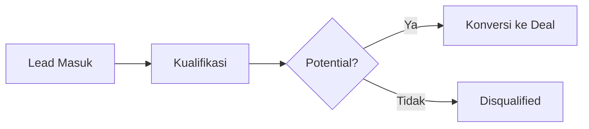

# Manajemen Leads

Fitur **Leads** adalah pintu masuk utama dalam siklus penjualan di CRM Pintar. Fitur ini dirancang untuk menangkap, melacak, dan mengonversi calon pelanggan potensial.

## Fitur Utama
*   **Dua Tampilan Utama**:
    *   **Kanban View**: Visualisasi lead berdasarkan tahapan (stages) dengan fitur drag-and-drop.
    *   **Table View**: Tampilan list yang ringkas dengan fitur filter dan pencarian lanjutan.
*   **Lead Stages**: Alur kerja yang dapat disesuaikan (misalnya: *New, Contacted, Qualified, Disqualified*).
*   **Lead Sources**: Melacak sumber datangnya lead (misalnya: *Website, Referral, Social Media, Event*).
*   **Konversi Lead**: Fitur untuk mengubah Lead yang sudah *Qualified* menjadi **Deal** hanya dengan satu klik, memindahkan data secara otomatis tanpa input ulang.

## Alur Kerja (Workflow)
1.  **Input Data**: Lead masuk melalui input manual oleh tim sales atau integrasi sumber eksternal.
2.  **Kualifikasi**: Tim sales melakukan kualifikasi awal dan memperbarui status di *Kanban Board*.
3.  **Interaksi**: Mencatat riwayat komunikasi dan aktivitas dalam detail lead.
4.  **Konversi**: Jika lead dinilai potensial (Qualified), gunakan fitur **Convert to Deal** untuk memindahkan data ke pipeline penjualan.

## Detail Informasi
Setiap lead menyimpan informasi kontak mendasar, catatan aktivitas, dan riwayat interaksi untuk memastikan tim sales memiliki konteks yang lengkap saat melakukan pendekatan.

