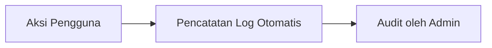

# Log Aktivitas & Audit Trail

Fitur **Log Activity** mencatat setiap tindakan penting yang dilakukan oleh pengguna di dalam sistem untuk tujuan keamanan dan transparansi.

## Fitur Utama
*   **Jejak Audit**: Rekaman siapa yang melakukan apa, kapan, dan pada data mana (misal: "User A mengubah status Deal X menjadi Won").
*   **Keamanan & Kepatuhan**: Membantu admin dalam memantau akses data sensitif dan perubahan konfigurasi sistem.
*   **Troubleshooting**: Memudahkan pelacakan penyebab jika terjadi kesalahan data dengan melihat riwayat perubahannya.
*   **Filter Pencarian Log**: Cari aktivitas berdasarkan pengguna, tipe aksi, atau rentang waktu tertentu.

## Alur Kerja (Workflow)
1.  **Trigger**: Pengguna melakukan perubahan data (Create, Update, Delete) pada modul apa pun.
2.  **Recording**: Sistem otomatis mencatat detail aksi, waktu, dan pelaku ke tabel log.
3.  **Review**: Admin mengakses halaman Log Activity untuk memantau keamanan atau melacak kesalahan.
4.  **Filtering**: Menggunakan filter untuk menyempitkan hasil pencarian aktivitas tertentu.

