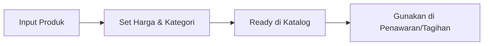

# Katalog Produk & Layanan

Modul **Products** berfungsi sebagai database pusat untuk semua barang atau jasa yang ditawarkan oleh perusahaan.

## Fitur Utama
*   **Manajemen Kategori**: Kelompokkan produk berdasarkan jenis atau departemen.
*   **Pricing Engine**: Atur harga standar, diskon default, dan satuan unit (misal: per jam, per unit, per lisensi).
*   **Deskripsi Detail**: Simpan informasi spesifikasi produk yang akan otomatis muncul saat membuat Quotation atau Invoice.
*   **Inventory Tracking**: (Opsional/Sesuai konfigurasi) Pantau ketersediaan stok produk fisik jika diperlukan.

## Alur Kerja (Workflow)
1.  **Pendaftaran**: Menginput data produk baru, harga, dan kategori ke sistem.
2.  **Katalogisasi**: Mengatur ketersediaan produk untuk digunakan dalam transaksi.
3.  **Penggunaan**: Tim sales memilih produk dari katalog saat membuat Quotation atau Invoice.
4.  **Update**: Memperbarui harga atau spesifikasi secara terpusat yang akan berdampak pada dokumen baru.

