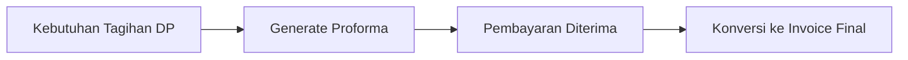

# Manajemen Proformas

**Proforma Invoices** digunakan sebagai tagihan sementara atau estimasi formal sebelum invoice final diterbitkan, sering digunakan untuk pembayaran di muka (DP).

## Fitur Utama
*   **Draft Penagihan**: Memberikan gambaran biaya kepada pelanggan sebelum komitmen final.
*   **Konversi ke Invoice**: Setelah pembayaran DP diterima atau pekerjaan dimulai, Proforma dapat dikonversi menjadi Invoice resmi dengan mudah.
*   **Standar Profesional**: Mengikuti format yang serupa dengan Invoice namun dengan label "Proforma" yang jelas untuk menghindari duplikasi pencatatan akuntansi.

## Alur Kerja (Workflow)
1.  **Request**: Dibuat ketika pelanggan memerlukan dokumen tagihan untuk pembayaran di muka (DP).
2.  **Billing**: Proforma dikirimkan untuk proses administrasi klien.
3.  **Payment**: Menunggu konfirmasi pembayaran sesuai nilai proforma.
4.  **Conversion**: Setelah pembayaran diterima, konversi Proforma menjadi **Invoice** final untuk pencatatan akuntansi yang sah.

