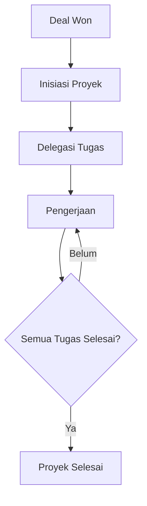

# Manajemen Proyek

Fitur **Projects** membantu tim dalam mengelola eksekusi pekerjaan setelah deal berhasil dimenangkan.

## Fitur Utama
*   **Sentralisasi Data Proyek**: Simpan semua informasi terkait proyek, klien, dan tenggat waktu dalam satu tempat.
*   **Monitoring Progress**: Pantau sejauh mana kemajuan proyek secara keseluruhan berdasarkan persentase penyelesaian tugas.
*   **Tim & Kolaborasi**: Tetapkan anggota tim yang bertanggung jawab pada proyek tertentu.
*   **Timeline Management**: Atur tanggal mulai dan estimasi selesai proyek untuk menghindari keterlambatan.

## Alur Kerja (Workflow)
1.  **Setup Proyek**: Inisiasi proyek baru setelah deal dimenangkan, menentukan manajer proyek dan tim.
2.  **Perencanaan**: Menentukan milestone dan tenggat waktu utama.
3.  **Eksekusi**: Membuat dan mendistribusikan **Tasks** kepada anggota tim.
4.  **Monitoring**: Memantau progress proyek melalui dashboard dan persentase penyelesaian tugas.
5.  **Closing**: Menyelesaikan semua tugas dan menandai proyek sebagai selesai.

## Hubungan dengan Tugas
Setiap Proyek dapat memiliki banyak **Tasks** yang mendetailkan langkah-langkah kerja yang harus dilakukan.

