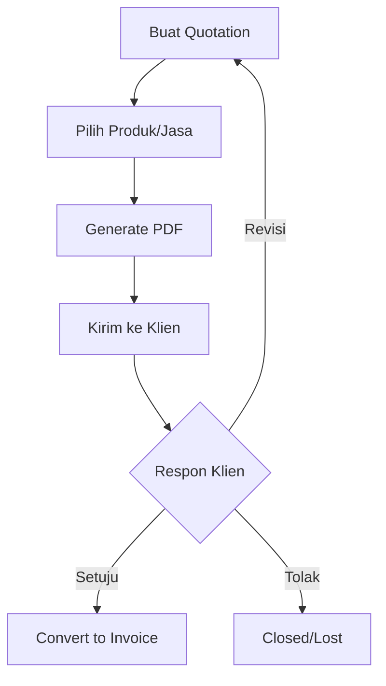

# Manajemen Quotations (Penawaran)

Fitur **Quotations** memungkinkan tim sales untuk membuat surat penawaran harga yang profesional dan akurat dalam hitungan menit.

## Fitur Utama
*   **Manajemen Item**: Tambahkan produk atau jasa dari katalog dengan harga yang dapat disesuaikan.
*   **Kalkulasi Pajak & Diskon**: Perhitungan otomatis untuk PPN, pajak lainnya, serta diskon per item atau total.
*   **Multi-Template PDF**: Pilihan berbagai template desain PDF yang profesional (Template 1-6) sesuai dengan citra perusahaan.
*   **Status Tracking**: Melacak apakah quotation masih *Draft, Sent, Approved,* atau *Rejected*.
*   **Versi Penawaran**: Kemampuan untuk merevisi penawaran tanpa menghapus riwayat sebelumnya.

## Alur Kerja (Workflow)
1.  **Drafting**: Membuat penawaran baru dan memilih item produk/jasa dari katalog.
2.  **Kustomisasi**: Menyesuaikan harga, diskon, dan pajak untuk setiap baris item.
3.  **Review & Export**: Memilih template desain dan mengunduh dokumen dalam format PDF.
4.  **Submission**: Mengirimkan penawaran kepada klien.
5.  **Approval**: Memperbarui status menjadi *Approved* jika klien setuju, yang kemudian dapat dikonversi menjadi **Invoice**.

## Teknologi
Proses pembuatan dokumen PDF dilakukan secara *client-side* menggunakan library **jsPDF**, memastikan proses yang cepat tanpa membebani server.

