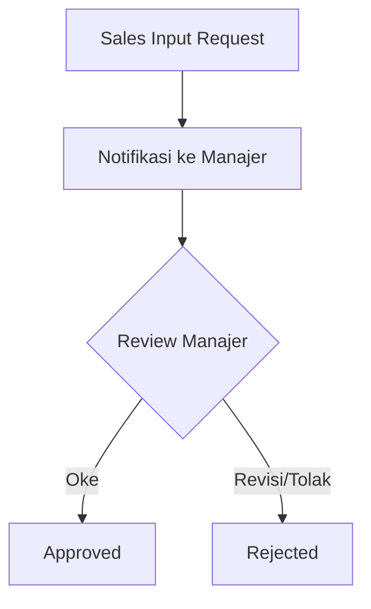

# Sales Requests

Fitur **Sales Requests** digunakan untuk mengelola permintaan internal dari tim sales terkait kebutuhan operasional atau persetujuan khusus.

## Fitur Utama
*   **Alur Persetujuan**: Mengajukan permintaan yang memerlukan approval dari atasan atau departemen lain.
*   **Tracking Status**: Pantau apakah permintaan masih *Pending, Approved,* atau *Rejected*.
*   **Dokumentasi Terpusat**: Semua permintaan terekam dalam sistem untuk transparansi dan koordinasi antar tim yang lebih baik.

## Alur Kerja (Workflow)
1.  **Submission**: Tim sales mengisi formulir permintaan (misal: request diskon khusus atau alat pendukung).
2.  **Notification**: Sistem mengirim notifikasi kepada manajer atau departemen terkait.
3.  **Review**: Manajer memeriksa detail dan memberikan catatan.
4.  **Decision**: Permintaan disetujui (Approved) atau ditolak (Rejected) dengan alasan yang jelas.

