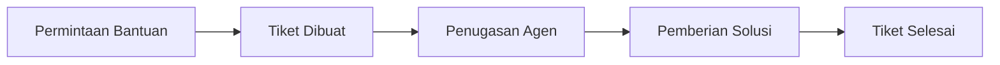

# Customer Support & Helpdesk

Modul **Support** adalah pusat bantuan untuk melayani pertanyaan dan kendala teknis pelanggan sehari-hari.

## Fitur Utama
*   **Ticket Management**: Sistem penomoran tiket untuk setiap permintaan bantuan pelanggan.
*   **Prioritas Tiket**: Bedakan permintaan yang mendesak (Critical) dengan pertanyaan umum (Low).
*   **Riwayat Dukungan**: Simpan jejak komunikasi antara tim support dan pelanggan untuk referensi di masa mendatang.
*   **Integrasi Pengetahuan**: Hubungkan tiket support dengan artikel di **Knowledge Base** untuk memberikan jawaban yang konsisten.

## Alur Kerja (Workflow)
1.  **Tiket Masuk**: Pelanggan mengirimkan permintaan bantuan yang kemudian didaftarkan sebagai tiket.
2.  **Delegasi**: Tiket secara otomatis atau manual ditugaskan kepada agen support yang tersedia.
3.  **Resolusi**: Agen berkomunikasi dengan pelanggan untuk menyelesaikan masalah.
4.  **Penutupan**: Tiket ditandai sebagai *Resolved* setelah solusi dikonfirmasi oleh pelanggan.

