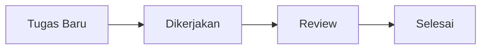

# Manajemen Tugas (Tasks)

**Tasks** adalah unit terkecil dari pekerjaan yang harus diselesaikan dalam suatu proyek atau aktivitas CRM lainnya.

## Fitur Utama
*   **Task List & Board**: Lihat tugas dalam format daftar yang rapi atau papan kerja.
*   **Prioritas & Deadline**: Tentukan tingkat kepentingan tugas (Low, Medium, High) dan batas waktu penyelesaian.
*   **Assignment**: Tugaskan pekerjaan ke anggota tim tertentu dengan notifikasi yang jelas.
*   **Status Workflow**: Lacak status tugas dari *To-Do, In Progress,* hingga *Completed*.
*   **Checklist**: Tambahkan sub-tugas dalam satu unit Task untuk detail yang lebih mendalam.

## Alur Kerja (Workflow)
1.  **Creation**: Tugas dibuat sebagai bagian dari proyek atau aktivitas harian.
2.  **Assignment**: Tugas diberikan kepada penanggung jawab dengan tenggat waktu.
3.  **Execution**: Penanggung jawab memperbarui status tugas seiring pengerjaan.
4.  **Verification**: (Opsional) Tugas direview oleh pemberi tugas.
5.  **Completion**: Tugas ditandai sebagai selesai dan progress proyek diperbarui otomatis.

